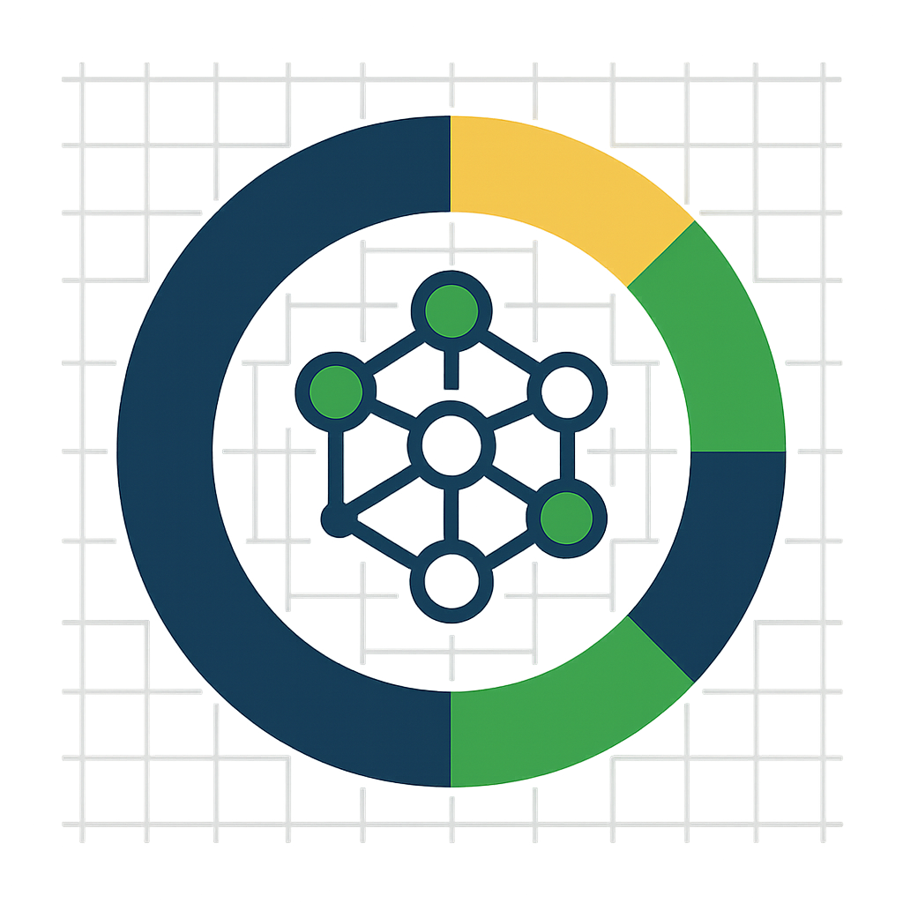

<h1 align="center"><b><a href="https://github.com/MiKL5/artificialIntelligence/blob/master/docs/other/bi">Business intelligence</a></b> </h1>

<!-- [Définition](https://github.com/MiKL5/artificialIntelligence/blob/master/docs/other/bi)  
- -->

<!-- <b><i>La Business Intelligence ou intelligence d’affaires en français, est un ensemble de technologies, processus et méthodologies permettant la collecte, l’analyse et la transformation des données brutes en informations significatives et utiles pour les prises de décisions en entreprise.</i></b>   -->
La veille économique (BI) fait référence aux stratégies, technologies et outils utilisés par les organisations pour analyser les données et présenter des informations exploitables. La BI aide les entreprises à prendre des décisions éclairées en transformant les données brutes en informations pertinentes grâce à des outils de visualisation, de reporting et d’analyse tels que Power BI, Tableau et autres.

___

 

[PostgreSQL](https://github.com/MiKL5/PostgreSQL)   
[SQL Server](https://github.com/MiKL5/SQLserver)   
[MongoDB](https://github.com/MiKL5/MongoDB)   

[Power BI](https://github.com/MiKL5/PowerBI)   
<!-- [Google Big Query](projects/sp98)   
[Locker Studio](projects/sp98)    -->

 
 
  <h2><b>Projets</b></h2>
<h3 align="left">Power BI</h3>
 

[Cinéma](https://github.com/MiKL5/PowerBI/tree/master/3_cinema)  
[Création de rapport](https://github.com/MiKL5/PowerBI/tree/master/6_rapportCinema)  
[Langage DAX](https://github.com/MiKL5/PowerBI/tree/master/8_tpDax)  
[Chiffres d’affaires des ventes](https://github.com/MiKL5/PowerBI/blob/master/9_tpVentes)  
[Analyse des ventes](https://github.com/MiKL5/PowerBI/blob/master/10_tpVentes1)  
 
<h3><a href="projects/sp98">Autres projets</a></h3> 
<!-- <a href="projects/sp98">Analyse et visualisation de données “Fr_carburants”   </a>   -->

<!--  
<h3><a href="docs" alt="Documentation">Documentation</a></h3> -->  

<h3><b>Contenu connexe</b></h3>

🧠 [Data Science](https://github.com/MiKL5/DS)  
🤖 [Intelligence artificielle](https://github.com/MiKL5/Artificial_Intelligence/)  
🤖🧠 [Machine Learning](https://github.com/MiKL5/machineLearning)  
<!-- 🤖📶 [IOT and AIoT](https://github.com/MiKL5/aiot)  -->
<!-- 🤖 [Robotique](https://github.com/MiKL5/robotics)   -->